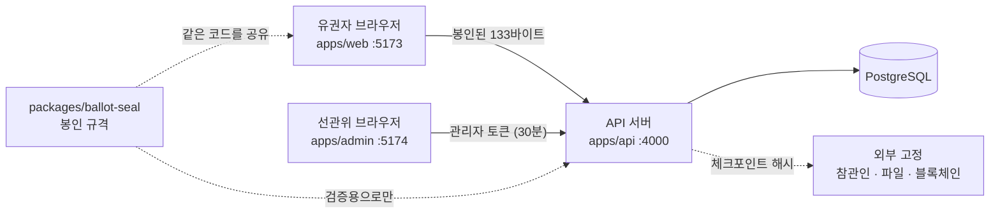
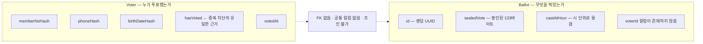
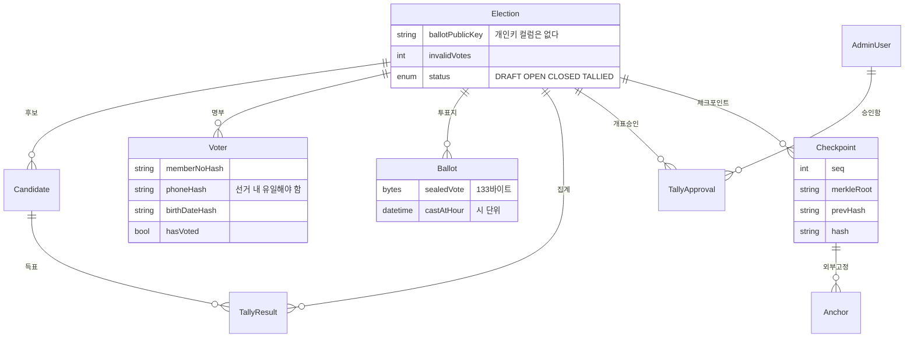

# 01. 시스템 구성

## 앱 구성



관리자 화면을 **별도 앱**으로 둔 이유:

- 유권자 번들에 관리자 코드가 섞이지 않습니다
- 배포 위치와 접근 제어(IP 제한 등)를 따로 걸 수 있습니다

`packages/ballot-seal`은 브라우저와 검증 스크립트가 **같은 파일**을 씁니다.
규격이 두 벌이면 언젠가 갈라지고, 갈라진 쪽이 표를 못 열게 됩니다.

## 설계의 핵심 한 가지

**"누가 투표했는가"와 "무엇을 찍었는가"를 물리적으로 분리한다.**



두 테이블을 잇는 컬럼이 **하나라도** 있으면 DB 접근 권한이 있는 사람(개발자·DBA·침입자)이
회원 개개인의 표를 볼 수 있습니다. 그러면 비밀투표가 아닙니다.
선거 후 분쟁에서 이 구조 자체가 "볼 수 없었다"는 증거가 됩니다.

## 그 원칙을 지키기 위해 딸려오는 것들

| 항목 | 이유 |
|---|---|
| 표를 **브라우저에서** 봉인 | 평문이면 DB·로그·TLS 종단 어디서든 개표 전 중간 집계가 나옵니다. 서버에서 봉인하면 침입자가 요청 핸들러에서 실시간으로 봅니다 |
| `Ballot.castAtHour`는 시(hour) 단위 | 초 단위 시각이 남으면 접속 로그의 로그인 시각과 대조해 표를 역추적할 수 있습니다 |
| 감사 로그의 `VOTER` 액션에 `actorRef` 없음 | 같은 이유. "몇 시 몇 분에 누가 투표"가 남으면 안 됩니다 |
| 확인번호에 후보 정보를 담지 않음 | 자기 표를 증명할 수 있으면 매표(vote buying)가 성립합니다 |
| 후보별 득표는 `TALLIED` 전까지 API가 거부 | 중간 집계 노출은 남은 유권자의 선택을 바꿉니다. 그것만으로 선거가 무효가 될 수 있습니다 |
| 회원번호·휴대폰은 HMAC 해시로만 저장 | DB만 유출되어도 명부를 복원할 수 없어야 합니다. pepper는 DB 밖(KMS)에 둡니다 |
| 개별 개봉 결과를 저장하지 않음 | 저장하는 순간 암호화로 얻은 것이 전부 사라집니다. `TallyResult`에 집계만 남깁니다 |

## 데이터 모델



`Voter`와 `Ballot` 사이에 선이 없는 것이 이 그림의 요점입니다.
둘 다 `Election`에만 걸려 있습니다.

### 개인키가 없다는 것의 의미

`Election.ballotPublicKey`는 있지만 **개인키를 담을 컬럼이 스키마에 없습니다.**
"저장하지 않기로 했다"가 아니라 **저장할 곳이 없습니다.** 선관위가 오프라인으로 보관하다가
개표 시점에만 주입합니다.

서버가 개인키를 들고 있으면 서버를 뚫은 사람이 곧 중간 집계를 볼 수 있어
암호화한 의미가 사라집니다.

## 1인 1표는 이 한 줄이 보장한다

[vote.service.ts](../apps/api/src/vote/vote.service.ts) 안:

```sql
UPDATE voter SET has_voted = true WHERE id = ? AND has_voted = false
```

원자적 compare-and-swap입니다. 같은 사람의 요청이 동시에 두 개 들어오면 Postgres가 행 잠금을
걸고, 나중 트랜잭션은 커밋된 값으로 `WHERE`를 재평가하므로 0건이 매칭됩니다 → 두 번째 표는
만들어지지 않습니다. 이 UPDATE와 `INSERT INTO ballot`이 한 트랜잭션 안에 있어서 둘 중 하나만
일어나는 상태가 없습니다.

**서로 다른 유권자는 서로 다른 행이므로 경합이 없습니다.**
1만 명이 같은 순간에 눌러도 잠금 대기가 생기지 않습니다.
이 설계에서 병목은 DB 커넥션 수이지 잠금이 아닙니다.
