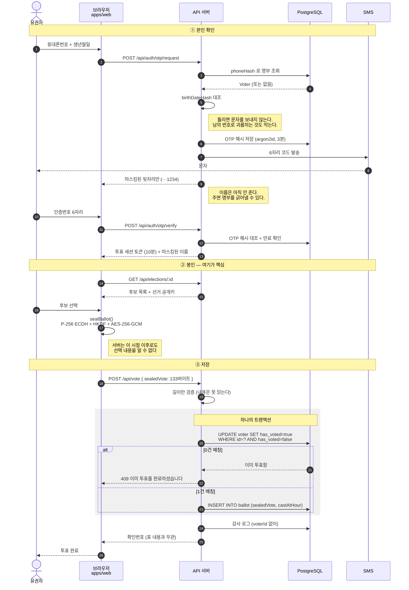
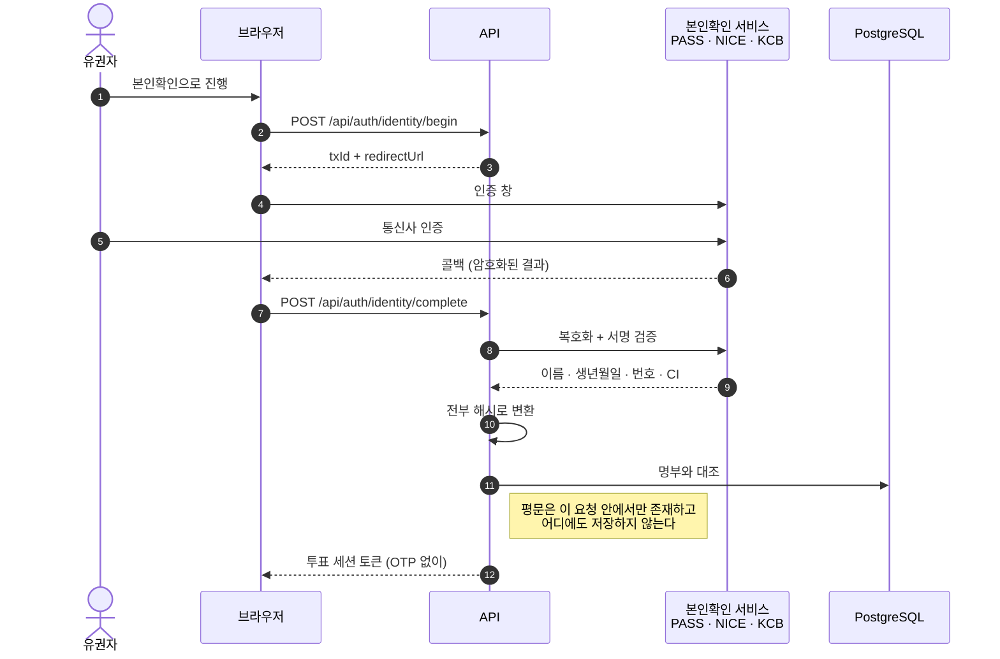
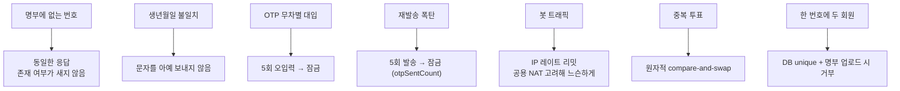
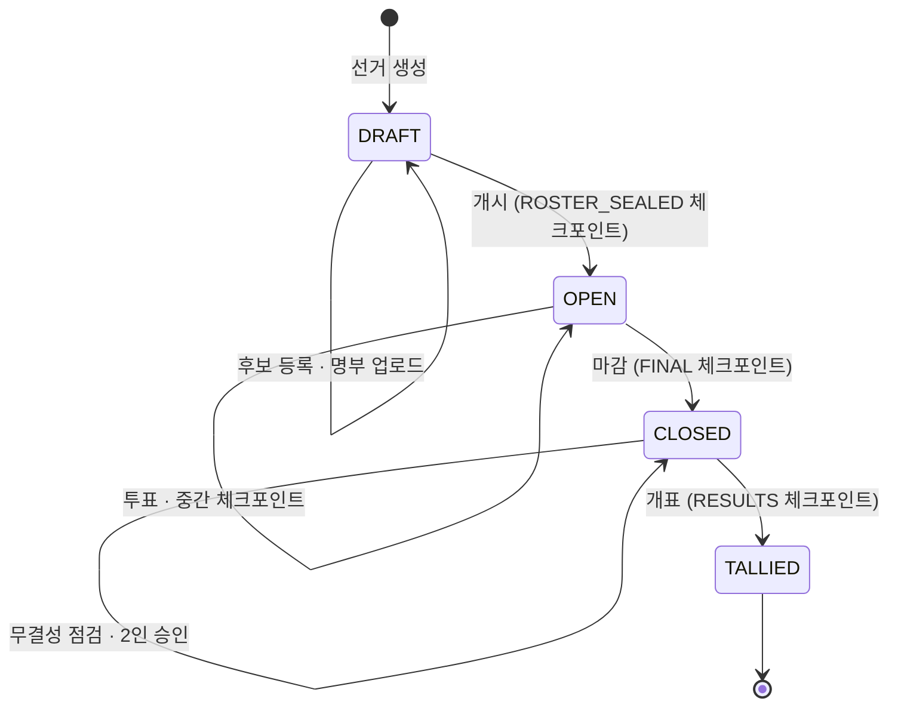

# 02. 투표 플로우

## 전체 — 로그인부터 저장까지



### 단계별로 서버가 아는 것

| 시점 | 서버가 아는 것 | 서버가 모르는 것 |
|---|---|---|
| OTP 요청 | 이 번호가 명부에 있다 | 이름을 응답에 담지 않음 |
| OTP 검증 | 이 유권자가 인증됐다 | — |
| 투표 요청 | 133바이트가 왔다, 누가 보냈다 | **무엇을 찍었는지** |
| 저장 후 | 이 사람이 투표했다(Voter), 어떤 봉인이 있다(Ballot) | **둘의 연결** |
| 개표 | 후보별 합계 | **개별 표의 주인** |

## 왜 인증에 생년월일이 붙는가

문자를 받았다는 것과 본인이라는 것은 다릅니다:

- 명부의 번호가 낡아 **지금은 남의 번호** → 그 사람이 코드를 받고 투표
- 가족·병원 직원이 폰을 들고 대리투표

생년월일은 회원번호와 달리 누구나 외우고 있어 투표율을 깎지 않으면서, 폰만 손에 넣은
사람은 통과하지 못합니다. 구분자를 어떻게 넣든(`1975-03-14`, `1975.3.14`, `19750314`)
받아줍니다 — 고령 유권자가 형식 때문에 막히면 안 됩니다.

| 방법 | 막는 것 | **못 막는 것** |
|---|---|---|
| SMS만 | 명부에 없는 사람 | 폰을 가진 누구나 |
| + 생년월일 | 폰을 줍거나 훔친 사람, 명부 번호가 낡은 경우 | **가족·직원 대리투표** |
| **+ 본인확인 서비스** | 위 전부 + 폰 명의가 본인이 아닌 경우 | 본인이 옆에서 시켜서 하는 경우 |

가족 대리투표는 생년월일로 못 막습니다 — 가족이면 아는 값이니까요.

## 본인확인 경로

`IDENTITY_VERIFICATION` 으로 켭니다: `off`(기본) · `optional` · `required`.



**방향이 뒤집혀 있는 게 요점입니다.** 명부는 해시만 갖고 있어서 이름·생년월일 평문을
서비스에 **보낼 수가 없습니다.** 그래서 서비스가 인증된 신원을 **돌려주면** 우리가
그걸 해시해서 명부와 대조합니다.

| 대조 항목 | 걸러지는 것 |
|---|---|
| `phoneHash` | 명부에 없는 번호 |
| `birthDateHash` | 번호는 명부에 있지만 다른 사람 |
| **`nameHash`** | **번호·생년월일은 맞는데 통신사 명의가 다른 사람 = 대리투표** |
| `ciHash` | 같은 사람이 다른 회원번호로 두 번 (CI 는 사람 단위 식별자) |

`nameMasked`("홍*동")로는 서로 다른 이름이 같은 값이 되어 대조가 안 되므로,
명부 등록 시 `nameHash` 를 따로 계산해 둡니다.

**OTP 를 거치지 않습니다.** 본인확인 서비스가 이미 문자/앱 인증을 하므로 우리 OTP 를
한 번 더 돌리면 문자 비용만 두 배가 됩니다. 그리고 `required` 에서는 **OTP 경로를
서버가 거부합니다** — 열어두면 그게 곧 우회로입니다.

CI 는 주민등록번호 파생값이라 저장하지 않고 해시만 둡니다.
보관 기간과 파기 절차를 선거관리규정에 명시하고 시작하세요.

> `IDENTITY_PROVIDER=mock` 은 제출된 신원을 그대로 믿습니다.
> production 에서 본인확인을 켠 채 mock 이면 **기동 자체를 거부**합니다.

## 투표 완료 문자

표를 던진 직후 문자가 나갑니다.

```
[협회장선거] 투표가 완료되었습니다. 확인번호 FYG7D24L
본인이 투표하지 않으셨다면 즉시 선거관리위원회로 연락해 주세요.
```

**명부에 있는 기권자 명의로 표를 채우는 조작**은 무결성 사슬로도 DB 권한 분리로도
잡히지 않습니다(명부가 안 바뀌니 `rosterHash` 가 그대로고, `hasVoted` 와 표 수를 같이
고치면 대조도 통과합니다). 이 문자가 그걸 잡는 유일한 수단입니다 —
투표하지 않은 회원이 이 문자를 받으면 그 자리에서 드러납니다.
문자는 협회 서버 밖(통신사)을 지나 회원 손전화에 남으므로 조작 범위 밖입니다.
**1만 명이 각자 자기 한 표의 참관인이 됩니다.**

두 가지를 지킵니다:

- **후보를 적지 않습니다.** 누구를 찍었는지 담으면 그게 곧 영수증이 되어 매표가 성립합니다
- **발송 실패가 투표를 되돌리지 않습니다.** 표는 이미 확정됐고, 여기서 예외를 던지면
  유권자는 실패한 줄 알고 다시 시도했다가 409 를 봅니다. 대신 `VOTE_RECEIPT_FAILED` 로
  반드시 기록합니다 — 못 간 문자만큼 이 방어가 비어 있습니다

번호는 어디에도 저장하지 않으므로, **서버가 서명한 챌린지 토큰**에 실어 보냈다가
인증 단계에서 돌려받아 세션에만 둡니다. 클라이언트가 남의 번호로 바꿔치기할 수
없습니다 — 서명을 위조해야 하기 때문입니다.

## 방어선 정리



`otpSentCount`가 1인당 방어선이고 IP 제한은 봇 차단용입니다.
같은 병원·의국에서 여러 회원이 동시에 투표하면 공용 NAT 뒤라 IP가 같기 때문입니다
(처음 IP당 분당 5회로 잡았다가 자체 테스트에서 바로 429가 터져 30회로 올렸습니다).

## 선거 상태 전이



명부는 `DRAFT`에서만 등록됩니다. 투표 시작 후 명부가 바뀌면 그 선거는 결과를 신뢰할 수
없기 때문입니다. 되돌아가는 화살표는 API에 존재하지 않습니다.
