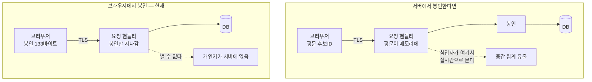
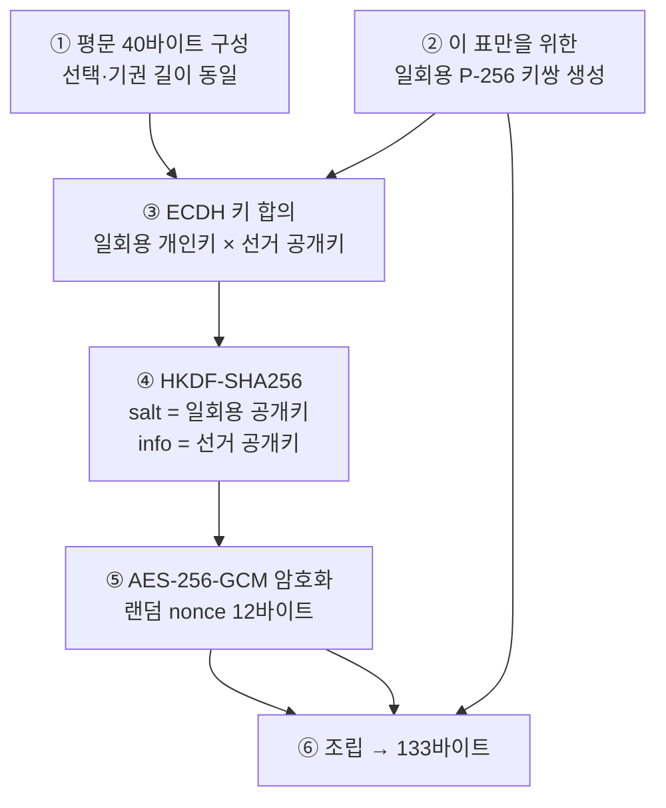

# 03. 투표지 봉인

구현: [packages/ballot-seal/seal.ts](../packages/ballot-seal/seal.ts) (봉인, 브라우저) ·
[apps/api/src/common/ballot-crypto.ts](../apps/api/src/common/ballot-crypto.ts) (개봉, 서버)

## 왜 서버가 아니라 브라우저인가

암호화의 목적은 "개표 전에 아무도 중간 집계를 볼 수 없게" 하는 것입니다.
서버에서 봉인하면 그 목적이 성립하지 않습니다.



서버 로그, APM 트레이스, 프록시 덤프, DB 슬로우 쿼리 로그 — 평문이 지나가는 지점이
하나라도 있으면 거기가 유출 경로가 됩니다. 브라우저에서 봉인하면 그 지점이 아예 없습니다.

## 봉인 절차



```
봉인된 표 = 133 바이트

  ┌──────────────────────┬────────────┬──────────────────────────┐
  │  일회용 공개키 65B   │  nonce 12B │  암호문 40B + 태그 16B   │
  └──────────────────────┴────────────┴──────────────────────────┘
     비압축 P-256 점       AES-GCM       평문 40B 를 암호화한 것

  평문 40바이트:
  ┌───┬────────────────────────────────────┬─────┐
  │ 1 │  후보 UUID 36바이트                │ 000 │
  └───┴────────────────────────────────────┴─────┘
    ↑  0 = 기권 (나머지 전부 0), 1 = 선택
```

각 결정의 이유:

| 결정 | 이유 |
|---|---|
| **표마다 일회용 키쌍** | 고정 키를 쓰면 같은 후보를 찍은 표는 암호문도 같아집니다. 내용을 못 읽어도 **암호문을 묶어 세는 것만으로 집계가 나옵니다** |
| **평문을 40바이트로 패딩** | 선택과 기권의 길이가 다르면 암호문 크기만 재고도 기권 여부를 알 수 있습니다 |
| **HKDF info에 선거 공개키** | 다른 선거로 표를 옮겨 붙이지 못하게 묶습니다 |
| **`extractable: false`** | 일회용 개인키를 JS가 꺼내볼 수 없고, 함수가 끝나면 참조가 사라져 회수됩니다. 되살릴 방법이 없습니다 |
| **AES-GCM (인증 암호)** | 봉인을 조작하면 개봉이 실패합니다. 조용히 다른 후보로 바뀌지 않습니다 |

검증: `GROUP BY sealedVote` 결과 최대 그룹 크기 1 — 같은 후보를 찍어도 봉인이 매번 다릅니다.

## 코드를 일부러 공개합니다

`seal.ts`는 유권자가 신뢰해야 하는 유일한 암호 코드입니다. 그래서 의도적으로:

- **짧게** — 60줄 남짓
- **라이브러리 없이** — 브라우저 내장 Web Crypto만 사용
- **난독화 없이**

후보 캠프·참관인 누구나 읽고 검증할 수 있어야 합니다.

WASM으로 만들어 바이너리로 감추는 안을 검토했지만 채택하지 않았습니다.
**공격자는 코드를 읽는 게 아니라 바꿔치기합니다.** 뚫린 서버가 조작된 번들을
내려보내면 WASM이든 JS든 똑같이 당합니다. 그리고 난독화된 코드는 참관인도 검증하지
못하므로, 방어는 못 얻고 검증 가능성만 잃습니다.

실질적인 방어는 **빌드 해시를 선거 전에 공고**해서 누구나 대조하게 만드는 것입니다
([08 문서](08-remaining.md) 참조).

## 대신 치른 비용 — 서버가 후보를 검증할 수 없다

서버는 개인키가 없으므로 투표 시점에 "이게 이 선거의 후보인가"를 확인할 방법이 없습니다.
길이 133바이트만 검사합니다.

쓰레기 표는 **개표 때 무효표로 집계**됩니다(`Election.invalidVotes`).
개표를 중단시키지 않는 이유는, 그렇게 하면 유권자 한 명이 쓰레기 표 하나로
선거 전체를 막을 수 있기 때문입니다.

`invalidVotes`가 0이 아니면 반드시 원인을 조사해야 합니다.

## 이게 막는 것과 못 막는 것

**막습니다**

- DB 유출 시 개표 전 중간 집계 — 봉인을 열 수 없습니다
- 서버 침입자의 실시간 집계 — 개인키가 서버에 없습니다
- 암호문 패턴으로 세기 — 일회용 키로 매번 다릅니다
- 표를 다른 선거로 옮겨 붙이기 — HKDF info로 묶여 있습니다

**못 막습니다**

- **뚫린 서버가 조작된 JS를 내려보내는 것** — 브라우저 암호화의 근본 한계입니다.
  빌드 해시 공고로 *대조 가능하게* 만들 수는 있습니다
- 유권자 PC가 이미 감염된 경우
- 개표키를 가진 사람이 임의 시점에 여는 것 — 이건 2인 승인이 막습니다([06 문서](06-admin-operations.md))
- 유권자 본인이 옆에서 지켜보는 사람에게 화면을 보여주는 것
