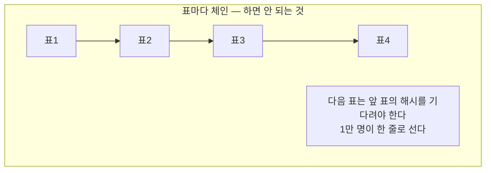
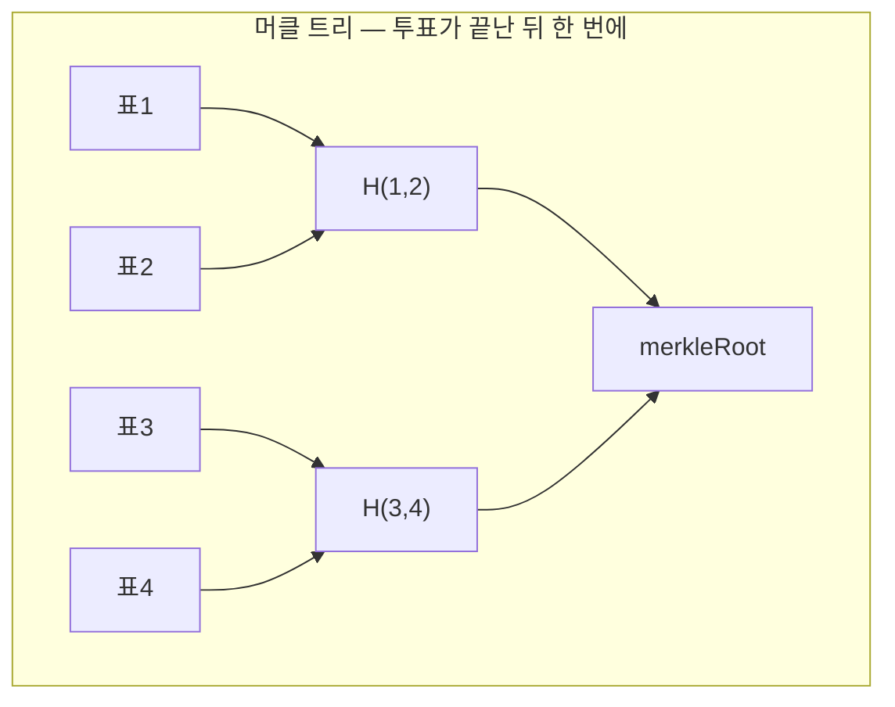
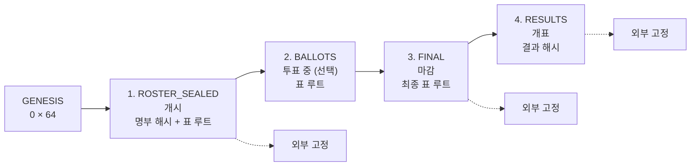
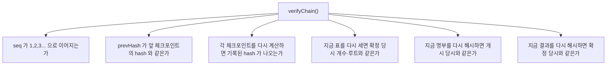

# 04. 무결성 사슬

구현: [merkle.ts](../apps/api/src/integrity/merkle.ts) ·
[integrity.service.ts](../apps/api/src/integrity/integrity.service.ts)

## 봉인만으로는 부족한 이유

봉인은 **개표 전에 표를 못 읽게** 합니다. 그런데 DB **쓰기** 권한이 있으면 얘기가 다릅니다.

| 공격 | 봉인만으로 막히나 |
|---|---|
| 개표 후 `TallyResult` 숫자를 고침 | ✗ |
| `Ballot` 행을 넣거나 지움 | ✗ (`Voter.hasVoted`도 같이 고치면 표 수 대조도 통과) |
| 감사 로그에서 흔적 삭제 | ✗ — 같은 DB |
| 명부에 가짜 유권자 추가 | ✗ |

전부 **한 DB 안에서 완결되므로** 내부 정합성 검사로는 잡히지 않습니다.

## 표마다 체인을 걸면 안 됩니다

흔한 실수입니다. 표마다 이전 해시를 물리면 **모든 투표가 한 줄로 직렬화**됩니다.



546표/초가 나오는 건 서로 다른 유권자가 서로 다른 행을 건드려 경합이 없어서인데,
체인 머리를 잠그는 순간 그게 사라집니다.

대신 **머클 트리 체크포인트**를 씁니다 — 투표 경로는 손대지 않고, 단계마다 그 시점의
상태를 해시로 굳혀 체크포인트끼리 연결합니다. Certificate Transparency와 같은 구조입니다.



RFC 6962의 도메인 분리를 따릅니다 — 잎에 `0x00`, 가지에 `0x01` 접두어를 붙여
잎 하나를 가지처럼 위장해 다른 트리를 만드는 2차 원상 공격을 막습니다.
잎이 홀수면 마지막 것을 자기 자신과 짝짓지 않고 그대로 올립니다
(자기복제 방식은 서로 다른 잎 집합이 같은 루트를 내는 취약점이 있습니다).

## 체크포인트 사슬



각 체크포인트가 담는 것:

```
hash = SHA256(
  "kma-checkpoint-v1" ‖ electionId ‖ seq ‖ kind ‖ ballotCount
  ‖ merkleRoot ‖ rosterHash ‖ resultsHash ‖ prevHash ‖ createdAt
)
```

`prevHash`로 앞의 것을 물고 있으므로 **중간 하나만 손대도 그 뒤 전부가 어긋납니다.**

`ROSTER_SEALED`가 개시 시점의 명부를 굳히는 것이 특히 중요합니다.
이게 없으면 투표 중에 가짜 유권자를 넣어놓고 "원래 그랬다"고 우길 수 있습니다.

## 검증이 잡아내는 것



## 실제로 DB를 고쳐서 확인했습니다

`npm run tamper:check --workspace=apps/api` — 검증 스크립트가 DB를 직접 고쳐 공격자를
흉내내고, 검증이 **실패로 뒤집히는지**를 봅니다. 각 시나리오는 확인 후 원상복구합니다.

```
1. 표를 몰래 넣으면      ✓ 탐지 (확정 당시 10장 → 현재 11장)
2. 표를 몰래 지우면      ✓ 탐지
3. 표를 바꿔치기하면     ✓ 탐지 (개수는 그대로인데도)
4. 가짜 유권자를 넣으면  ✓ 탐지 (명부가 개시 당시와 다릅니다)
5. 체크포인트를 고치면   ✓ 탐지 (자기 해시와 안 맞음)
6. 체크포인트를 지우면   ✓ 탐지 (사슬이 끊김)
7. 득표수를 고치면       ✓ 탐지

8. 사슬을 통째로 다시 만들면 내부 검증은 통과한다 — 외부 고정이 필요한 이유
```

**8번을 일부러 넣었습니다.** DB를 통째로 쥔 공격자는 표를 고친 뒤 체크포인트도 처음부터
다시 계산해 끼워넣으면 그만입니다. 사슬은 "내부적으로 앞뒤가 맞는가"만 보장합니다.

그래서 사슬의 머리를 외부에 고정해야 합니다 → [05 문서](05-blockchain-anchoring.md)

## 검증은 로그인 없이 공개됩니다

```
GET /api/elections/:id/integrity/chain     사슬 전체 + 고정 기록
GET /api/elections/:id/integrity/verify    재계산 대조 결과
```

관리자만 볼 수 있으면 "협회가 스스로를 검증했다"가 되어 의미가 없습니다.
나가는 값은 전부 해시라 표도 명부도 복원되지 않습니다.

## 이게 하는 일과 못 하는 일

**합니다**

- 조작을 **탐지**합니다
- 외부 고정이 있으면 협회 스스로도 되돌릴 수 없습니다

**못 합니다**

- 조작을 **막지는** 못합니다. 드러나게 할 뿐입니다
- **아무도 대조하지 않으면 무의미합니다.** 참관인이 받은 해시를 실제로 맞춰봐야 합니다
- 시스템이 뚫린 뒤 만들어진 데이터를 고정하면 **조작된 상태가 영구 보존**될 뿐입니다.
  고정 이전 단계(명부·인증·봉인)가 먼저 맞아야 합니다
- "시스템이 기록한 것"을 증명할 뿐, "유권자가 의도한 것"은 증명하지 못합니다
- **명부에 있는 기권자 명의로 표를 채우는 것**은 잡지 못합니다. 명부가 안 바뀌니
  `rosterHash` 가 그대로고, `hasVoted` 와 표 수를 함께 고치면 대조도 통과합니다.
  이건 투표 완료 문자([08 문서](08-remaining.md))가 담당합니다

조작이 **체크포인트 이전에** 일어나면 사슬은 그 조작된 상태를 그대로 굳힙니다.
사슬이 지키는 것은 "T 시점 이후로 안 바뀌었다"뿐입니다. T 이전은
DB 계정 분리([06 문서](06-admin-operations.md))와 절차가 담당합니다.
