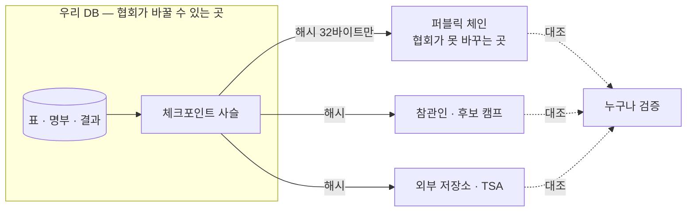
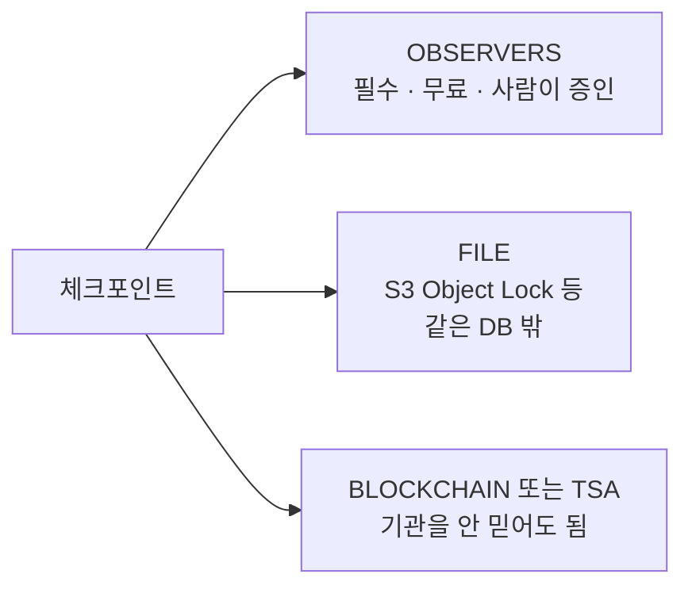

# 05. 블록체인 고정 — 준비 상태

> **한 줄 답: 연결되어 있습니다.** `ANCHOR_TARGETS`에 `BLOCKCHAIN`을 넣고 노드 주소와
> 지갑만 채우면 개시·마감·개표 때 자동으로 고정됩니다. 검증 30개 항목이 통과합니다.
> 남은 건 코드가 아니라 **체인 선택과 지갑 키 운영 결정**입니다.

## 먼저: 블록체인은 저장소가 아니라 공증인입니다

표를 체인에 올리는 게 아닙니다. **해시만** 올려서 "그 시각에 이 값이 있었다"를
협회가 나중에 못 바꾸게 굳히는 용도입니다.



표를 체인에 올리자는 제안은 반드시 거절하세요. 퍼블릭 체인은 영구 공개이므로
봉인된 표라도 올라가면 **개표키가 언젠가 유출됐을 때 전 국민이 개별 표를 열어볼 수
있게** 됩니다. 우리 DB에서라면 그때 지우기라도 하지만 체인에서는 지울 수 없습니다.

## 붙이는 방법

### 1. 환경변수만 채우면 됩니다

```bash
ANCHOR_TARGETS="FILE,OBSERVERS,BLOCKCHAIN"

ANCHOR_CHAIN_RPC="https://..."        # 노드의 JSON-RPC 주소
ANCHOR_CHAIN_ID="1"                   # 연결된 체인이 맞는지 확인용
ANCHOR_CHAIN_PRIVATE_KEY="0x..."      # 고정용 지갑 (개표키와 같은 등급)
ANCHOR_CHAIN_CONFIRMATIONS="2"
ANCHOR_CHAIN_EXPLORER="https://etherscan.io/tx"
ANCHOR_CHAIN_TRUST_NOTE="검증자 5곳: 협회 1 · 후보캠프 3 · 외부감사 1"
```

Besu 는 JSON-RPC 호환이므로 **퍼블릭이든 컨소시엄이든 같은 설정**으로 붙습니다.
`ANCHOR_CHAIN_ID` 는 필수에 가깝습니다 — 엉뚱한 체인에 남기면 나중에 아무도 못 찾는데,
이 값이 있으면 연결이 다를 때 고정을 거부합니다.

### 2. 체인에 올라가는 것

**해시뿐입니다.** 사람이 블록 탐색기에서 눈으로 읽을 수 있는 형태로 싣습니다 —
참관인이 대조하는 것이 이 고정의 존재 이유이기 때문입니다.

```
KMA1|3f2a9c14-77b1-4a3e-9d55-6c0e1b8a4d02|3|a3f9c2b1…(64자)
 │            선거 id                      │        체크포인트 해시
 └ 형식 표시                          체크포인트 순번
```

108바이트. 선거당 3~5건이므로 수수료는 실질적으로 문제가 되지 않습니다.

**스마트 컨트랙트를 쓰지 않습니다.** 자기 주소로 0원을 보내면서 `data` 필드에만
싣습니다. 컨트랙트를 두면 그 코드가 새 공격 표면이 되고 참관인이 검증할 대상도 늘어납니다.

### 3. 확인

```bash
npm run chain:check --workspace=apps/api    # 우리 코드 검증 (체인 불필요)
```

가짜 노드를 세우고 **받은 서명 트랜잭션을 실제로 해독해서** 검사합니다 —
우리 지갑이 서명했는지, 체크포인트 해시가 그대로 실렸는지, 0원인지, 되읽어 대조가 되는지.
Besu 가 잘 도는지는 우리가 테스트할 일이 아니고, **우리가 보내는 것이 맞는지**가 확인 대상입니다.

막아야 할 것도 함께 봅니다: 다른 체인에 연결되면 거부, 잔액이 0이면 미리 거부,
되돌려진 트랜잭션을 성공으로 처리하지 않음, 운영에서 개발용 공개 키를 쓰면 기동 거부.

### 4. 선거 후 대조 — 이게 없으면 고정한 의미가 없습니다

```bash
npm run anchor:verify --workspace=apps/api -- --election <선거 id>
```

체인에서 트랜잭션을 가져와 **체인에 실제로 실린 글자**를 기준으로 지금 DB 의 체크포인트와
맞춰봅니다. 우리 서버가 저장해둔 값은 믿지 않습니다.

```
✓ #1 ROSTER_SEALED — 체인의 값과 일치 (블록 103 · 확정 1블록 · 0x8129891a…)
✓ #2 BALLOTS       — 체인의 값과 일치
✓ #3 FINAL         — 체인의 값과 일치
3 일치
```

고정 이후 체크포인트를 고치면 이렇게 됩니다:

```
✗ #1 ROSTER_SEALED — 해시가 다릅니다 — 고정 이후 무언가 바뀌었습니다
    체인 b7863811513ca468… / DB ffffffffffffffff…
2 일치, 1 불일치
체인에 남은 값과 지금 DB 가 다릅니다. 반드시 원인을 조사하세요.
```

참관인·후보 캠프가 직접 돌릴 수 있어야 합니다. `--rpc` 로 **자기가 믿는 노드**를 지정할 수
있으므로, 협회 노드를 거치지 않고 확인할 수 있습니다.

## 결정해야 할 것 — 코드가 아니라 여기가 남았습니다

### 어느 체인인가

| 후보 | 장점 | 단점 |
|---|---|---|
| **Ethereum 메인넷** | 가장 널리 검증 가능. 분쟁에서 설명이 쉬움 | 수수료가 가장 비쌈 (선거당 몇 건이라 무의미한 수준) |
| L2 (Polygon·Arbitrum 등) | 훨씬 저렴 | 검증자가 적고, L1 만큼 오래 남는다는 보장이 약함 |
| **컨소시엄 Besu** (IBFT·QBFT) | 수수료 없음, 우리가 운영 | **검증자 구성이 전부다** — 아래 참조 |

### 프라이빗/컨소시엄이면 검증자를 누가 운영하나 — 가장 중요합니다

**협회가 검증자를 전부 운영하면 보장이 0입니다.** 원장을 다시 쓸 수 있으므로
우리 DB 에 체크포인트를 다시 만드는 것과 다르지 않습니다.
"블록체인을 썼다"는 라벨만 남고 실제로 바뀌는 것이 없습니다.

의미가 생기려면 검증자를 **이해관계가 다른 곳들이 나눠** 운영해야 합니다 —
후보 캠프별로 하나씩, 외부 감사인, 유관 기관. 그런데 그러면 실질적으로
"참관인이 노드를 돌리는 것"이고, 참관인에게 문자로 해시를 보내는 것과 보장의 성격이 같습니다.
비용만 수십 배입니다.

그래서 `ANCHOR_CHAIN_TRUST_NOTE` 에 검증자 구성을 적게 해뒀습니다.
이 값이 고정 기록에 함께 남습니다 — **그 구성이 곧 신뢰의 근거**이기 때문입니다.

### 지갑 개인키를 어떻게 보관하나

**이 키가 털리면 가짜 고정을 만들 수 있습니다.** 개표키와 같은 등급입니다.

다만 개표키와 다른 점이 하나 있습니다 — 단계 전환마다 서명해야 하므로
**투표 기간 내내 온라인이어야 합니다.** 그래서 개표키처럼 오프라인 보관이 불가능합니다.

- KMS/HSM 에 두고 서명만 위임하세요.
  [anchor.ts](../apps/api/src/integrity/anchor.ts) 의 `loadPrivateKey()` 가 그 자리입니다
- 이 지갑은 **고정 전용**으로만 쓰고 다른 용도로 쓰지 마세요
- 잔액을 미리 채워두세요. 마감 순간에 수수료가 없어 실패하면 그 구간은 검증할 수 없습니다
  (잔액이 0이면 미리 거부하도록 해뒀습니다)
- 운영에서 개발 도구의 공개된 시드 키를 쓰면 **기동 자체를 거부**합니다

### 공개 절차 — 빠뜨리면 전부 무의미합니다

트랜잭션 해시는 `Anchor.reference` 에 저장되고
`GET /api/elections/:id/integrity/chain` 으로 이미 공개됩니다. 남은 건 사람 쪽입니다:

- 선거 공고에 **어느 체인 어느 주소**에 남기는지 미리 명시
- 참관인에게 블록 탐색기 대조 방법 안내 (또는 `anchor:verify` 사용법)
- 대조 결과를 선거 종료 후 문서로 남기기

**아무도 대조하지 않으면 블록체인에 올린 것도 아무 의미가 없습니다.**

## 그런데 블록체인이 최우선은 아닙니다

기술적으로 화려하지만, **실제 분쟁에서 가장 강한 것은 참관인 발송입니다.**
이해관계가 다른 여러 사람이 같은 해시를 각자 들고 있으면, 협회가 나중에
무슨 짓을 해도 맞춰보는 순간 드러납니다. 무료이고 즉시 됩니다.

권장 조합:



**성격이 다른 둘 이상을 쓰세요.** 한 곳만 쓰면 그곳이 단일 실패 지점이 됩니다.

지금 기본값은 `ANCHOR_TARGETS="FILE"` 하나인데, **그 파일이 서버 안에 있는 한
공격자도 고칠 수 있어 그 자체로는 고정이 아닙니다.** 실제 선거 전에 반드시 바꿔야 합니다.

## 오해하지 말 것

- 블록체인에 올린다고 **표가 안전해지지 않습니다.** 올라가는 건 해시뿐입니다
- **표를 체인에 올리자는 제안은 반드시 거절하세요.** 블록 타임스탬프가 초 단위로 영구
  기록되어, `castAtHour` 로 일부러 지운 시각 정보를 체인이 되살려 줍니다. 게다가 개표키가
  언젠가 유출되면 그때 전 국민이 개별 표를 열어볼 수 있고, 우리 DB 와 달리 지울 수 없습니다
- **투표를 블록체인으로 하는 것**과 **결과를 블록체인에 공증하는 것**은 완전히 다릅니다.
  이 시스템은 후자입니다
- 조작된 데이터를 고정하면 **조작된 상태가 영구 보존**될 뿐입니다.
  명부·인증·봉인이 먼저 맞아야 합니다
