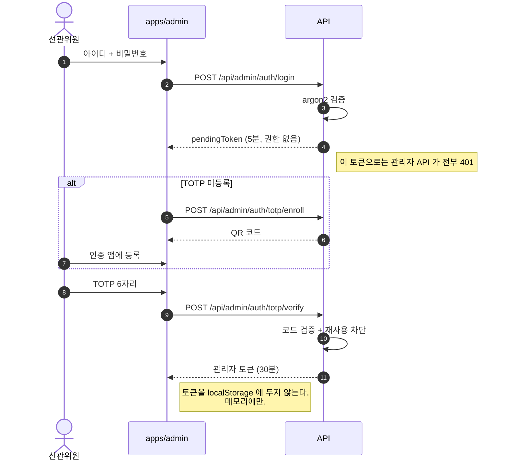
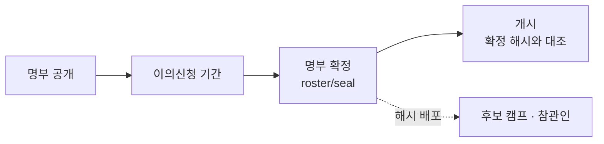
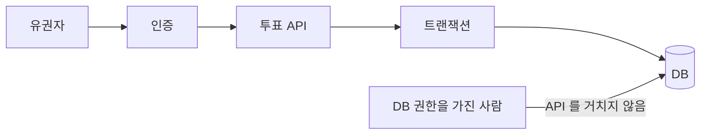
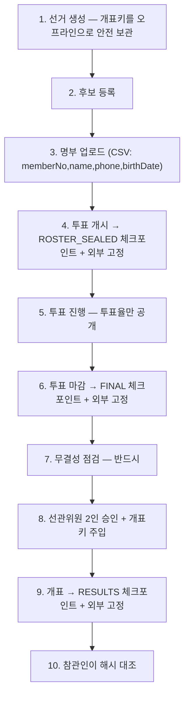

# 06. 관리자와 운영

## 관리자 인증

선관위 계정 하나가 뚫리면 선거 전체가 무너집니다. 그래서 비밀번호만으로는
아무것도 할 수 없게 만들었습니다.



| 방어 | 구현 |
|---|---|
| 계정 목록 유출 | 없는 계정과 틀린 비밀번호가 **같은 응답**. 없는 계정도 argon2를 한 번 돌려 응답 시간까지 맞춤 |
| 무차별 대입 | 5회 실패 → 30분 잠금. 비밀번호와 TOTP가 같은 카운터를 공유 |
| 코드 훔쳐보기 | 이미 쓴 시간 슬롯의 TOTP는 유효시간이 남아도 거부 (`afterTimeStep`) |
| 시계 오차 | 과거 방향 30초만 허용. 미래 방향은 열지 않음 |
| 2차 인증 갈아끼우기 | 등록된 계정은 재등록 불가 — 세션을 뺏겨도 공격자 기기로 옮길 수 없음 |
| 퇴임한 위원 | 매 요청마다 DB에서 `disabledAt` 확인. 남은 토큰이 만료까지 도는 걸 막음 |
| 역할 | 기본이 거부. 참관인(AUDITOR)에게 열어줄 조회 API에만 `@Roles` 명시 |

**관리자 계정을 만드는 HTTP 엔드포인트는 일부러 없습니다.** 서버 접근 권한이 있는
사람만 CLI로 만들 수 있습니다:

```bash
npm run admin:create --workspace=apps/api -- --id kim --name 김위원 --role COMMISSIONER
npm run admin:create --workspace=apps/api -- --id lee --name 이참관 --role AUDITOR
```

임시 비밀번호가 출력되고 다시 볼 수 없습니다. 비밀번호를 인자로 받지 않는 것은
셸 히스토리와 프로세스 목록에 남기 때문입니다.

## 개표 2인 승인 (dual control)


- 같은 사람이 두 번 눌러 정족수를 채울 수 없습니다 (`@@unique([electionId, adminId])`)
- 참관인(AUDITOR)은 승인할 수 없습니다
- 무결성 점검이 깨져 있으면 승인 자체를 받지 않습니다
- 개표키는 **승인할 때마다 다시 입력**합니다. 세션에도 담지 않습니다

`TALLY_QUORUM`으로 바꿀 수 있지만 **1로 낮추지 마세요.** 계정 하나가 뚫렸을 때
그 사람이 임의 시점에 개표해 결과를 먼저 보는 걸 막는 게 이 장치의 목적입니다.

## 관리자 화면 (`apps/admin` :5174)

| 화면 | 하는 일 |
|---|---|
| 로그인 | 비밀번호 → TOTP. 최초 로그인이면 QR로 2차 인증 등록 |
| 선거 목록 | 상태·선거인 수·투표율 한눈에 |
| 새 선거 | 선거 정보 + 후보 등록. **생성 직후 개표키를 한 번만 보여줍니다** |
| 선거 상세 | 명부 등록 → 개시 → 마감 → 개표 승인 → 결과 |

설계에서 신경 쓴 것들:

- **토큰을 `localStorage`에 두지 않습니다.** XSS 한 번으로 선거 전체가 넘어가고,
  공용 PC에서 브라우저를 닫아도 남습니다. 메모리에만 두므로 새로고침하면 다시
  로그인해야 하지만 선관위 화면은 그게 맞습니다
- **개표키 화면은 건너뛸 수 없습니다.** "안전한 곳에 보관했다"를 체크해야 닫힙니다.
  서버에 저장하지 않으므로 놓치면 개표가 영구히 불가능합니다
- **후보별 득표는 개표 전까지 이 화면에도 안 나옵니다.** 선관위 화면이라고 예외를
  두면 그 화면이 곧 유출 경로가 됩니다. 진행 중에 보이는 건 투표율뿐입니다
- 되돌릴 수 없는 행동(개시·마감)은 현재 수치를 보여주는 확인 창을 거칩니다
- 참관인(AUDITOR)은 모든 수치를 보지만 버튼이 아예 나오지 않습니다

## 개표키 분산 (Shamir 3-of-5)

개표키를 한 사람이 통째로 들고 있으면 두 가지가 동시에 문제가 됩니다.

- **잃어버리면 개표가 영구히 불가능합니다.** 복구 경로가 없습니다.
  1만 명이 던진 표가 전부 열리지 않은 채로 끝납니다. 아무도 공격하지 않아도 터집니다
- 개표를 2인 승인으로 막아놓고 키는 한 명이 쥐고 있으면 dual control 이 반쪽입니다

5명에게 나눠 3명이 모여야 복원되게 하면 둘 다 풀립니다.
**2명까지 잃어버려도 개표할 수 있고, 2명이 담합해도 아무것도 못 합니다.**

```bash
# 선거 생성 직후 — 인터넷이 끊긴 노트북에서 해도 됩니다
npm run key:split --workspace=apps/api -- --n 5 --k 3 --public-key <선거 공개키>

# 개표 당일 — 위원들이 한자리에 모여 각자 조각을 입력
npm run key:combine --workspace=apps/api -- --public-key <선거 공개키>
```

**서버는 이 기능을 쓰지 않습니다.** 조각을 서버가 받는 순간 서버가 개표키를 아는 것이
되어 분산의 의미가 사라집니다. 두 스크립트 모두 네트워크를 쓰지 않고 DB 에 붙지 않습니다.

조각은 한 줄짜리 텍스트라 종이에 적어 봉투에 넣을 수 있습니다:

```
KMA-KEY-1.3.2.zX9c…(base64url)….a3f9c2b1
         │ │                     └ 검증값 — 다른 개표키의 조각을 섞으면 즉시 걸립니다
         │ └ 조각 번호
         └ 복원에 필요한 개수
```

지켜야 할 것: 조각을 **한 사람에게 하나씩**(한 명이 둘을 가지면 정족수가 그만큼 낮아집니다),
**전달 경로도 나눠서**(같은 메신저로 전부 보내면 그 계정 하나가 뚫릴 때 끝),
그리고 **원본 개표키를 파기**해야 합니다.

`k-1`개 이하로는 원본에 대해 **아무것도** 알 수 없습니다. 계산이 어려운 게 아니라
정보 자체가 없습니다(information-theoretic).

> GF(256) 구현에서 생성원을 2로 잡는 흔한 실수를 했다가 검증에서 잡혔습니다.
> AES 다항식에서 2의 위수는 51이라 로그표의 5분의 4가 비고, `mul(a,3)`이 `mul(a,1)`과
> 같아지는 식으로 **조용히 틀린 값**을 냅니다. 그래서 "3개 조합 10가지가 전부 복원되는가"를
> 검증에 넣었습니다 — 몇 가지만 보면 놓칩니다.

## 명부 사전 확정 — 공개한 명부와 쓴 명부가 같음을 증명

개시 시점에만 명부를 굳히면 한 구간이 비어 있습니다: **명부를 공개해 이의신청을 받은
뒤 개시하기 전까지** 바꿔치기하면 아무도 모릅니다.



```bash
POST /api/admin/elections/:id/roster/seal
```

확정하면 **명부를 더 이상 바꿀 수 없고**, 개시할 때 확정 당시 해시와 대조해서
다르면 **개시 자체를 거부**합니다. 확정 후 DB 를 직접 고쳐 유권자를 밀어넣어도
개시가 막히는 것을 검증에 포함했습니다.

반환되는 `rosterHash`를 **개시 전에** 후보 캠프·참관인에게 전문 그대로 배포하세요.
사후에 배포하면 "공개한 명부와 실제 쓴 명부가 같다"가 증명되지 않습니다.

## 감사 로그 외부 반출

로그가 같은 DB 에만 있으면 DB 를 쥔 사람이 지울 수 있고, 무엇보다 **지워졌다는 사실
자체를 알 수 없습니다.** 원래 몇 줄이었는지 아무도 모르기 때문입니다.

그래서 DB 밖으로 한 벌 더 내보내고 **줄마다 이전 줄의 해시를 물립니다.**

```bash
AUDIT_SINKS="FILE"          # FILE | HTTP (쉼표로 여럿)
npm run audit:check --workspace=apps/api
```

`audit:check` 는 두 가지를 봅니다 — 반출본 사슬이 온전한가, 그리고 **반출본에 있는 줄이
DB 에도 다 있는가**. 두 번째가 존재 이유입니다: DB 에서 지워진 로그를 찾아냅니다.

**사슬은 프로세스(인스턴스)마다 따로 이어집니다.** 여러 인스턴스가 한 파일에 append 하면
서로의 사슬이 끼어들어 전부 깨집니다 — 인스턴스를 늘릴 때 조용히 터지는 종류의
버그라 처음부터 파일을 갈라뒀습니다. 재시작해도 이어 쓰려면 `AUDIT_INSTANCE_ID` 를 고정하세요.

한계 두 가지:

- **파일이 같은 서버 안에 있으면** 공격자가 사슬을 통째로 다시 만들 수 있습니다.
  append-only 외부 저장소(S3 Object Lock 등)나 `AUDIT_EXPORT_URL` 로 실어 날라야
  비로소 고정이 됩니다
- 반출은 비동기라 **강제 종료 시 꼬리가 유실**됩니다. 정상 종료(SIGTERM)에서는
  큐를 비우고 나가지만, SIGKILL 은 막을 방법이 없습니다

## DB 계정 분리 — 정문을 안 지나가는 경로 막기

인증은 **밖에서 들어오는 사람**을 막습니다. 이미 안에 있는 사람은 막지 않습니다.



`INSERT INTO \"Ballot\"` 한 줄이면 문자도, 로그인도, 1인1표 검사도 실행되지 않습니다.
그래서 **서버가 쓰는 계정에서 애초에 그 권한을 뺍니다.**

```bash
npm run db:privileges   --workspace=apps/api   # 계정 생성 + 권한 적용
npm run privilege:check --workspace=apps/api   # 실제로 막혔는지 확인
```

| 테이블 | 앱 계정 권한 | 뺀 이유 |
|---|---|---|
| **Ballot** | SELECT · INSERT | 표는 넣기만 합니다. 고치거나 지울 일이 없습니다 |
| **AuditLog** | SELECT · INSERT | 지울 수 있으면 감사 로그가 아닙니다 |
| **Checkpoint** | SELECT · INSERT | 고칠 수 있으면 무결성 사슬이 아닙니다 |
| **Anchor** | SELECT · INSERT | 외부 고정 기록도 append-only |
| TallyResult | SELECT · INSERT | 개표는 한 번만 실행됩니다 |
| TallyApproval | SELECT · INSERT | 승인은 취소되지 않습니다 |
| AdminUser | SELECT · UPDATE | 계정 생성은 CLI(소유자)로만 |
| Voter | SELECT · INSERT · UPDATE | `hasVoted`·OTP 갱신에 필요. DELETE 는 뺌 |
| Election | SELECT · INSERT · UPDATE | 상태 전이에 필요. DELETE 는 뺌 |
| Candidate | SELECT · INSERT · DELETE | DRAFT 에서 후보 명단 교체 |

스키마에 `CREATE` 권한도 주지 않습니다 — 테이블을 만들 수 있으면 트리거로 위 제약을
전부 우회할 수 있습니다.

**연결은 두 개입니다.**

| | 쓰는 곳 | 성격 |
|---|---|---|
| `DATABASE_URL` | NestJS 서버 | 권한을 깎은 계정 |
| `DIRECT_URL` | 마이그레이션, 운영자 스크립트 | 소유자. **앱 서버에 두지 마세요** |

시딩·관리자 계정 생성·변조 검증 같은 스크립트는 소유자로 붙습니다
([owner-db.ts](../apps/api/scripts/owner-db.ts)). 권한 분리를 우회하는 게 아니라
모델링하는 것입니다 — 실제로도 그 스크립트들은 서버 접근 권한이 있는 사람만 돌립니다.

### 검증

`npm run privilege:check` 가 그 계정으로 직접 붙어 **금지된 작업이 거부되는지** 확인합니다
(19개 항목). 존재할 수 없는 id 를 대상으로 하므로, 권한이 잘못 열려 있어도 지워지는
행이 없습니다.

```
앱이 반드시 할 수 있어야 하는 것    표 조회 · 표 추가 · 투표 여부 갱신 · 감사 로그 기록
막혀 있어야 하는 것 — 표            표 수정 ✓거부   표 삭제 ✓거부
막혀 있어야 하는 것 — 흔적          감사 로그 수정·삭제 · 체크포인트 수정·삭제 ✓거부
막혀 있어야 하는 것 — 그 외         관리자 계정 생성 · 테이블 생성 ✓거부
```

### 한계

**소유자 계정을 쥔 사람은 여전히 무엇이든 할 수 있습니다.** 이건 공격 경로를
"DB 접근"에서 "소유자 계정 접근"으로 좁히는 것이지 없애는 게 아닙니다.
그래서 소유자 자격증명은 앱 서버에 두지 않고, 마이그레이션할 때만 꺼내 씁니다.

그리고 **명부에 있는 기권자 명의로 표를 넣는 것**은 이걸로도 못 막습니다 —
그건 투표 완료 문자가 담당합니다 ([08 문서](08-remaining.md)).

> **스키마를 바꾼 뒤에는 권한을 다시 적용해야 합니다.** 새 테이블은 아무 권한도 없는
> 상태로 시작하므로(fail closed) 앱이 그 테이블을 못 읽습니다.
> `npm run prisma:deploy` 가 마이그레이션 직후 자동으로 재적용하도록 묶어뒀습니다.

## 선거 운영 순서



| 단계 | 엔드포인트 |
|---|---|
| 명부 업로드 (휴대폰 중복 시 거부) | `POST /api/admin/elections/:id/roster` |
| 투표 개시 | `POST /api/admin/elections/:id/open` |
| 투표 마감 | `POST /api/admin/elections/:id/close` |
| 무결성 점검 | `GET  /api/admin/elections/:id/integrity` |
| 개표 승인 (2인 + 개표키) | `POST /api/admin/elections/:id/tally` |
| 개표 승인 현황 | `GET  /api/admin/elections/:id/tally` |
| 중간 체크포인트 | `POST /api/admin/elections/:id/integrity/checkpoint` |
| 수동 외부 고정 | `POST /api/admin/elections/:id/integrity/anchor` |
| 사슬 공개 조회 (**인증 불필요**) | `GET  /api/elections/:id/integrity/chain` |
| 사슬 검증 (**인증 불필요**) | `GET  /api/elections/:id/integrity/verify` |

**개표 전 무결성 점검을 반드시 돌리세요.** "투표했다고 표시된 사람 수"와 "실제 표 수"가
다르면 어딘가 잘못된 것이고, 그대로 개표하면 안 됩니다.
이 점검은 표 수 대조와 해시 사슬 검증을 함께 봅니다 — 표 수 대조는 공격자가 양쪽을
같이 고치면 통과하지만, 사슬은 그 방법으로 속일 수 없습니다.

## 실행

```bash
# 최초 1회 — VOTER_ID_PEPPER / JWT_SECRET 생성해서 apps/api/.env 에
openssl rand -hex 32

npm run db          # 터미널 1 — 로컬 Postgres (127.0.0.1:5433)
npm run dev         # 터미널 2 — API + 유권자 + 관리자 전부
npm run dev:admin   #            관리자만 (API + :5174)
npm run dev:voter   #            유권자만 (API + :5173)

npm run seed        # 시드 데이터

npm run check       # 검증 5종 전부 (DB 말고는 미리 띄울 것 없음)
npm run test:e2e    # E2E 만
npm run test:ui     # 브라우저를 띄워서 눈으로
```

Docker 없이 돌아갑니다 — `node_modules` 안의 PostgreSQL 바이너리를 그대로 씁니다.
