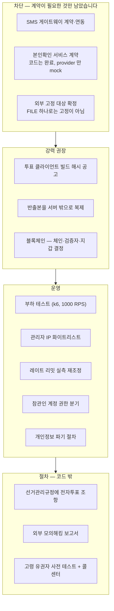

# 08. 남은 것 — 실제 선거 전에 반드시 채울 것

지금 코드는 **투표 흐름 자체는 완성**이지만, 실제 협회장 선거에 쓰려면 아래가 남았습니다.

## 차단 수준

> 셋 다 **계약이 필요한 항목**입니다. 코드로 할 수 있는 것은 끝났고, provider 를
> 갈아끼우는 자리와 검증까지 준비되어 있습니다.

**1. SMS 연동** — [sms.service.ts](../apps/api/src/auth/sms.service.ts)의 `send()`
한 군데만 교체하면 됩니다. NAVER SENS / NHN Toast / 알리고 중 계약 후 연동.
1만 명 × 재발송 + 참관인 발송을 감안해 **3만 건 이상** 한도를 확보하세요.

이것 하나가 세 곳을 동시에 엽니다 — **유권자 인증**, **투표 완료 문자**(기권자 명의
투표 탐지), **참관인 해시 발송**(가장 강한 외부 고정).

**2. 본인확인 서비스 연동** — 대조 로직·명부 연결·CI 중복 차단·모드 제어는 전부
되어 있고 검증도 통과합니다([02 문서](02-flow-voting.md)). 남은 건
[identity-verification.ts](../apps/api/src/auth/identity-verification.ts)의
`RealIdentityProvider` 두 메서드입니다: 거래 생성 API 호출, 그리고 **콜백 복호화 +
서명 검증**. 서명 검증 없이 복호화만 하면 위조된 결과를 그대로 믿게 됩니다.
건당 50~100원이니 1만 명 기준 예산을 잡으세요.

협회장 선거처럼 법적 효력이 있는 선거라면 **선택이 아니라 필수에 가깝습니다.**

**3. 무결성 고정 대상 확정** — 기본값은 `ANCHOR_TARGETS="FILE"` 인데, 그 파일이 서버
안에 있는 한 공격자도 고칠 수 있어 **그 자체로는 고정이 아닙니다.** 최소한 참관인
발송(`OBSERVERS`)을 붙이고 외부 저장소나 블록체인을 하나 더 쓰세요. 참관인 명단은
**선거 시작 전에** 확정하고 공개해야 합니다 — 사후에 고를 수 있으면 유리한 사람에게만
보낼 수 있습니다.

## 강력 권장

**4. 투표 클라이언트 빌드 해시 공고** — 뚫린 서버가 조작된 JS를 내려보내는 건 막을 수
없지만, **대조는 가능하게** 만들 수 있습니다. 빌드 해시를 선거 전에 후보 캠프·참관인에게
배포하고 기간 중 누구나 확인하게 하세요. 난독화보다 훨씬 실질적인 방어입니다.

**5. 반출본을 서버 밖으로** — 감사 로그 반출과 무결성 고정은 구현되어 있지만, 파일이
**같은 서버 안에 있는 한 공격자가 사슬을 통째로 다시 만들 수 있습니다.** append-only
외부 저장소(S3 Object Lock 등)나 외부 수집기(`AUDIT_EXPORT_URL`)로 복제해야 비로소
고정이 됩니다.

**6. 블록체인 고정 — 쓸지 말지 결정 (선택)** — 코드는 완료되어 있고 검증 30개 항목이
통과합니다. 환경변수만 채우면 자동으로 고정됩니다. 남은 것은 결정입니다:
**어느 체인인가**, 컨소시엄이면 **검증자를 누가 나눠 운영하는가**(협회가 전부 운영하면
보장이 0입니다), 그리고 **지갑 개인키를 어디에 두는가**(개표키와 같은 등급인데 투표 기간
내내 온라인이어야 합니다). 참관인 발송으로 대부분 대체되므로 순서상 마지막입니다 —
[05 문서](05-blockchain-anchoring.md).

## 운영 수준

**7. 부하 테스트** — 마감 1시간 전에 트래픽이 몰립니다. k6로 동시 1,000 RPS 기준 검증.
DB 커넥션 풀(`connection_limit`)과 앞단 오토스케일링을 여기에 맞춰 잡으세요.

**8. 관리자 IP 화이트리스트** — 선관위 사무실만.

**9. 레이트 리밋 실측 재조정** — OTP 요청 제한은 IP 기준인데, 같은 병원·의국에서
여러 회원이 동시에 투표하면 공용 NAT 뒤라 IP가 같습니다. 1인당 방어선은 DB의
`otpSentCount`(5회)가 담당하므로 IP 제한은 봇 차단용으로만 두되,
**대형병원 회원 비중을 보고 값을 다시 정하세요.**

**10. 참관인(AUDITOR) 계정 운영** — 권한 분기 자체는 되어 있습니다. 관리자 API 19개 중
조회 6개(선거 목록·현황·무결성·개표 승인 현황·사슬 검증·비밀번호 변경)만 열려 있고
나머지는 기본 거부이며, "참관인은 개표 승인 불가 403"이 검증에 포함되어 있습니다.
남은 건 **누구에게 계정을 줄지, 언제 만들고 언제 회수할지**를 선거관리규정에 맞춰
정하는 절차입니다.

**11. 개인정보 파기 절차** — 선거 종료 후 명부 해시·전화번호 해시의 보관 기간과
파기 시점을 선거관리규정에 맞춰 정하고 배치로 자동화.

## 절차 수준 — 코드 밖

**12.** 선거관리규정에 전자투표 조항이 있는지 확인. **없으면 시스템보다 규정 개정이 먼저입니다.**

**13.** 정보보호 취약점 점검 — 이 규모의 협회 선거는 외부 모의해킹 보고서를 남겨두는 게
분쟁 시 방어에 결정적입니다.

**14.** 유권자 다수가 고령입니다. UI는 큰 글자·큰 터치 영역으로 잡아뒀지만,
실제 회원 10명 정도로 사전 테스트를 권합니다. 콜센터 대응 스크립트도 함께.

---

## 완료된 것

- ~~관리자 로그인 + TOTP~~ → [06 문서](06-admin-operations.md)
- ~~개표 2인 승인~~ → [06 문서](06-admin-operations.md)
- ~~관리자 화면 (별도 앱)~~ → [06 문서](06-admin-operations.md)
- ~~브라우저 봉인~~ → [03 문서](03-ballot-sealing.md)
- ~~결과 무결성 사슬~~ → [04 문서](04-integrity-chain.md)
- ~~DB 계정 권한 분리~~ → [06 문서](06-admin-operations.md)
- ~~본인확인 서비스 (연동 provider 제외)~~ → [02 문서](02-flow-voting.md)
- ~~투표 완료 문자~~ → [02 문서](02-flow-voting.md)
- ~~개표키 분산 (Shamir 3-of-5)~~ → [06 문서](06-admin-operations.md)
- ~~명부 사전 확정 + 해시 배포~~ → [06 문서](06-admin-operations.md)
- ~~감사 로그 외부 반출~~ → [06 문서](06-admin-operations.md)
