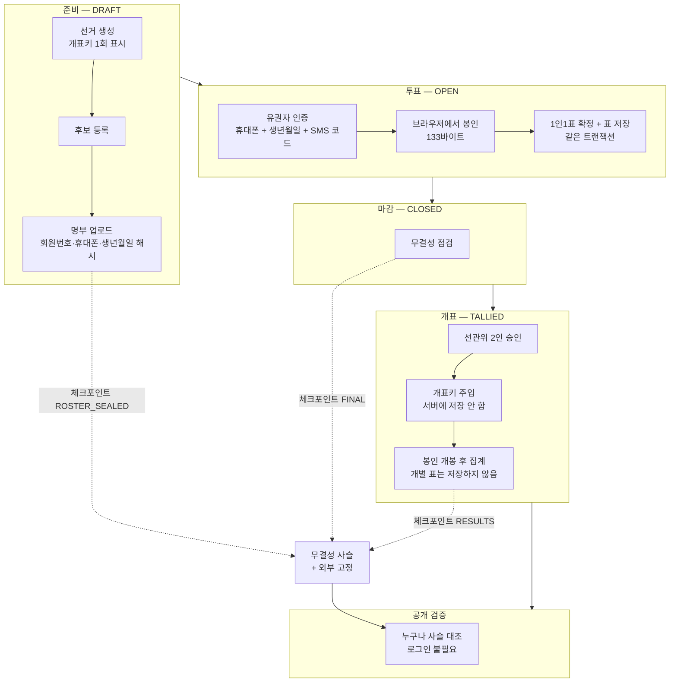

# 문서

협회장 선거 전자투표 시스템의 설계·검증 문서입니다.
저장소 루트의 [README.md](../README.md)는 "빠르게 실행하고 훑어보기"용이고,
이 폴더는 **왜 그렇게 만들었는지**와 **무엇이 검증되었는지**를 나눠 담았습니다.

| 문서 | 내용 |
|---|---|
| [01. 시스템 구성](01-architecture.md) | 앱 구성, 데이터 모델, 익명성이 성립하는 근거 |
| [02. 투표 플로우](02-flow-voting.md) | 로그인부터 저장까지 전 과정 다이어그램 |
| [03. 투표지 봉인](03-ballot-sealing.md) | 브라우저 암호화 규격, 왜 서버가 아닌가 |
| [04. 무결성 사슬](04-integrity-chain.md) | 머클 체크포인트, 조작 탐지 |
| [05. 블록체인 고정](05-blockchain-anchoring.md) | 붙이는 방법과 결정해야 할 것 |
| [06. 관리자와 운영](06-admin-operations.md) | 선관위 인증, 선거 운영 순서 |
| [07. 검증과 실측](07-verification.md) | 검증 스크립트 115개 항목, 성능 수치 |
| [08. 남은 것](08-remaining.md) | 실제 선거 전에 반드시 채울 것 |
| [명령어 매뉴얼](COMMANDS.md) | 모든 명령 · 인자 · 자주 막히는 곳 |

---

## 전체 흐름 한 장

되돌아가는 전이는 API에 존재하지 않습니다. 개표를 되돌릴 수 있으면 결과를 신뢰할 수 없습니다.

## 지금 어디까지 됐나

| 영역 | 상태 |
|---|---|
| 유권자 인증 (휴대폰 + 생년월일 + OTP) | 완료 — **SMS 게이트웨이만 mock** |
| 본인확인 서비스 (통신사 명의 대조) | 완료·검증됨 — **연동 provider 만 mock** |
| 투표 완료 문자 (기권자 명의 투표 탐지) | 완료·검증됨 — 발송이 mock |
| 개표키 분산 (Shamir 3-of-5) | 완료·검증됨 |
| 명부 사전 확정 + 해시 배포 | 완료·검증됨 |
| 감사 로그 외부 반출 (해시 사슬) | 완료·검증됨 |
| 브라우저 봉인 → 저장 | 완료·검증됨 |
| 1인 1표 (동시성 포함) | 완료·검증됨 |
| 관리자 인증 (비밀번호 + TOTP) | 완료·검증됨 |
| 개표 2인 승인 | 완료·검증됨 |
| 관리자 화면 (별도 앱) | 완료 |
| 무결성 사슬 + 조작 탐지 | 완료·검증됨 |
| DB 계정 권한 분리 | 완료·검증됨 |
| 외부 고정 — 파일 | 완료 (단, 그 자체로는 고정이 아님 → 05 문서) |
| 외부 고정 — 참관인 발송 | 대상 확정까지만. 실제 발송은 SMS 연동 후 |
| 외부 고정 — **블록체인** | 완료·검증됨 — **체인 선택과 지갑 운영만 결정하면 됨** → [05 문서](05-blockchain-anchoring.md) |

